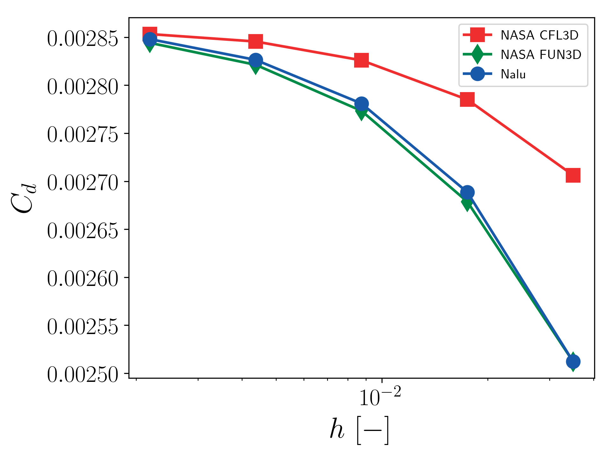
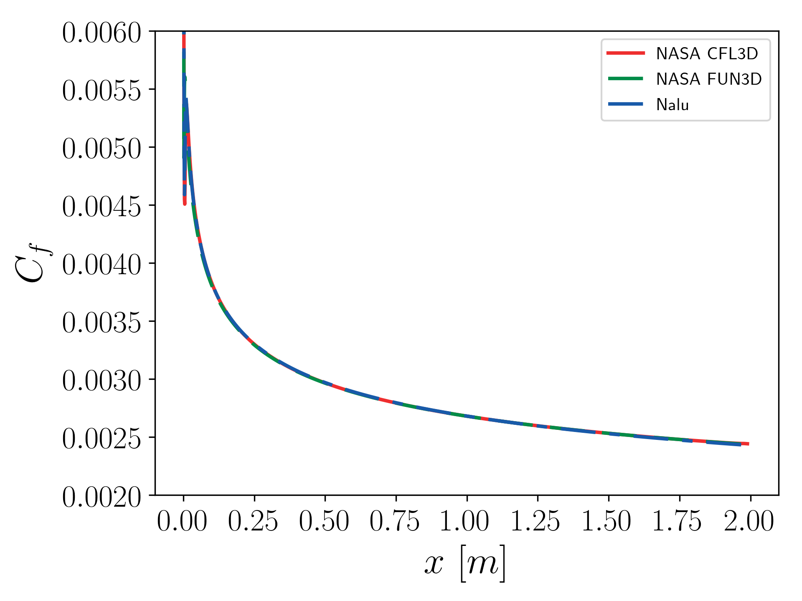
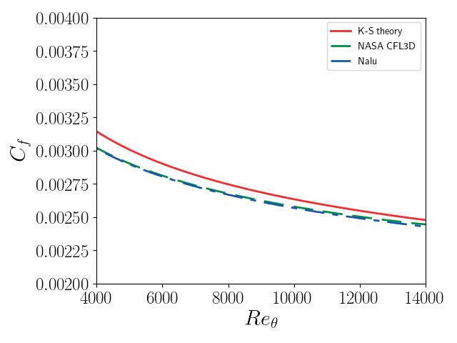

# Flat plate verification and validation

This presents verification and validation efforts for the SST
implementation in [Nalu-Wind](https://github.com/Exawind/nalu-wind) using
NASA's
[2D Zero Pressure Gradient Flat Plate](https://turbmodels.larc.nasa.gov/flatplate.html). The
setup, grids, and NASA code results are all taken from that website.

The initial conditions are chosen to ensure the same flow
conditions. The Mach number and Reynolds number (based on a reference
length scale of 1m) are 0.2 and 5 million. The length of the flat
plate is 2m. The density of air is 1.177 kg/m^3 and the viscosity is
1.846e-5 kg/ms. The inflow velocity is therefore 78.4197 m/s. No
pressure gradient is imposed between the inlet and outlet (though the
NASA setup does indicate a small pressure drop across the domain). To
ensure as close a setup as the NASA test cases, no wall function is
used to model the SST wall boundary conditions and the BC for the SST
model are set according to
the
[NASA specifications](https://turbmodels.larc.nasa.gov/flatplate_sst.html).

## Using this repository
A.  Generating the meshes

1. Get CGNS mesh from [the NASA website](https://turbmodels.larc.nasa.gov/flatplate_grids.html)
2. Use Pointwise to label the surfaces and set the BC

B. Running

```
mpiexec -np 1 ./naluX -i flatPlate.yaml
```

C. Post-processing
```
./pp.py # reads Nalu data, generates tables of quantities of interest
./plot_verification.py
./plot_validation.py
```

## Results using RANS SST

These results were generated using Nalu-Wind [SHA ID
004f0b915ea07e1616f0877a32690bebf810f238](https://github.com/Exawind/nalu-wind/commit/004f0b915ea07e1616f0877a32690bebf810f238).

### Verification

There is good agreement between Nalu-Wind's SST implementation
and
[NASA's SST implementation](https://turbmodels.larc.nasa.gov/flatplate_sst.html).

#### Convergence of skin friction coefficient at x = 0.97


#### Convergence of drag coefficient


#### Skin friction coefficient along the plate at t = 0.5 (545x385 mesh)


#### Nondimensional eddy viscosity at x=0.97 (545x385 mesh)


#### SST blending functions at x=0.97 (545x385 mesh)


#### Nondimensional TKE at x=0.97 (545x385 mesh)


#### Nondimensional SDR at x=0.97 (545x385 mesh)


#### Velocity profile x=0.97 (545x385 mesh)


#### Velocity profile x=0.97 (545x385 mesh)


### Validation
Nalu-Wind results are compared to flat plate theoretical results and NASA
code
results. See
[here](https://turbmodels.larc.nasa.gov/flatplate_val.html)
and
[this paper](https://turbmodels.larc.nasa.gov/NAS_Technical_Report_NAS-2016-01.pdf) for
validation details. There is good agreement between theoretical
results and Nalu-Wind simulation results (545x385 mesh).

#### Skin friction: theory and simulation


#### Velocity laws: theory and simulation (at Re_theta = 10000)


## Thanks
Thanks to Shreyas Ananthan, Ganesh Vijayakumar, and Matt Barone for
their helpful insight and input.
